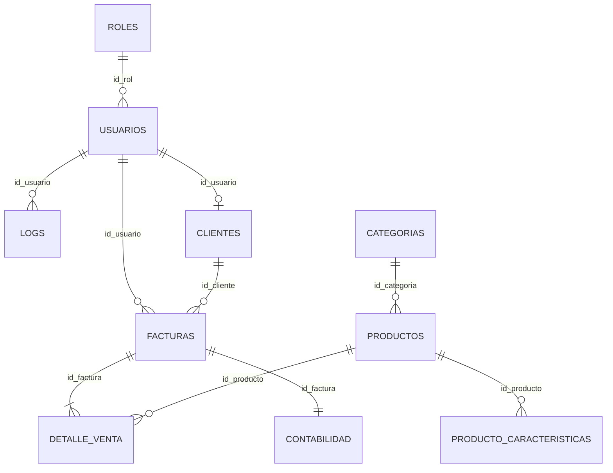

# TechFlow 🚀
**Sistema de Gestión B2B e E-commerce B2C Integrado**

TechFlow es una plataforma de software híbrida diseñada para resolver las necesidades logísticas, contables y de ventas de una empresa tecnológica. El sistema combina un potente panel administrativo (Backoffice / B2B) y una tienda virtual autogestionada para los clientes (Storefront / B2C), manteniendo una estricta pureza e integridad en la base de datos.

## 🛠️ Stack Tecnológico
La aplicación sigue una arquitectura Cliente-Servidor separando responsabilidades:

- **Frontend**: React.js (Vite) + Vanilla CSS (Glassmorphism UI).
- **Backend**: Node.js + Express (API RESTful).
- **Base de Datos**: PostgreSQL alojada y gestionada a través de Supabase.
- **Seguridad**: Autenticación vía JWT (JSON Web Tokens) y contraseñas cifradas con `Bcryptjs`.
- **Integraciones AI**: Sistema simulador de IA para la auto-generación de especificaciones técnicas (Specs).

---

## 💎 Los 4 Módulos Esenciales

TechFlow está construido sobre cuatro pilares fundamentales que garantizan la operatividad completa de la empresa:

1.  📦 **Gestión de Inventario (Almacén)**: Control exhaustivo de stock en tiempo real, categorización avanzada y gestión de especificaciones técnicas.
2.  🛒 **Punto de Venta y Facturación (B2B)**: Terminal para ventas directas con validación síncrona de existencias y generación de comprobantes.
3.  🏛️ **Contabilidad y Libro Diario**: Sistema de asientos automáticos que registra cada ingreso financiero para auditorías y balances inmediatos.
4.  🌐 **Tienda Digital Autogestionada (B2C)**: Portal público donde los clientes pueden registrarse, comprar y descargar sus propias facturas sin intervención manual.

---

## ⚙️ Características Técnicas Principales
1. **Transaccionalidad Atómica**: Generación de facturas con validación síncrona de inventario para evitar *over-selling*.
2. **Registro de Auditoría (Bitácora)**: Logs automáticos de las principales operaciones CRUD vinculados al ID del usuario en sesión.
3. **Libro Diario Contable Automático**: Al procesar una factura web o local, se disparan "Asientos Contables" de ingreso para seguimiento financiero.
4. **Link B2C Inteligente**: La plataforma separa el `Usuario` (Credencial segura) del `Cliente` (Perfil fiscal), vinculándolos dinámicamente mediante una Foreign Key opcional durante el primer checkout del cliente.

---

## 🗄️ Modelo Relacional de Datos (ERD)
La base de datos se rige por las reglas de la 3FN (Tercera Forma Normal).



> Para mayor información técnica sobre los diccionarios de datos, refiérase al documento de configuración interna.

---

## 🚀 Instalación y Despliegue Local

Sigue estos pasos para levantar el entorno de desarrollo en tu máquina local.

### 1. Clonar y preparar dependencias
Asegúrate de ejecutar el comando de instalación en la raíz del proyecto para instalar las dependencias generales (Vite, React, Express, etc.).
```bash
git clone <url-del-repositorio>
cd ProyectoEmpresarial
npm install
```

### 2. Configurar Variables de Entorno
Crea un archivo `.env` dentro de la carpeta `server/` (o en la raíz según tu config de backend) y agrega tus credenciales de Supabase:
```env
SUPABASE_URL=https://<tu-proyecto>.supabase.co
SUPABASE_KEY=<tu-anon-key-o-service-role>
SECRET_KEY=<tu-string-seguro-para-firmar-jwt>
PORT=5000
```

### 3. Setup de Base de Datos (Supabase)
Toma el código SQL ubicado en el archivo `server/schema.sql` y ejecútalo en la consola SQL de tu panel de Supabase. Esto creará la estructura de 10 tablas, las dependencias de llaves foráneas y los datos iniciales (Roles básicos y Categorías).

### 4. Inicializar Aplicación (Desarrollo)
La arquitectura está empaquetada. Para arrancar el cliente de React (Frontend):
```bash
npm run dev
```
Para inicializar el servidor API local (Backend), abre una segunda terminal y ejecuta:
```bash
cd server
node index.js
```
El frontend suele exponerse en `http://localhost:5173` y la API corre por defecto en `http://localhost:5000`.

---
*Desarrollado y estructurado orgánicamente para cumplir con altos estándares de desarrollo de software empresarial.*
